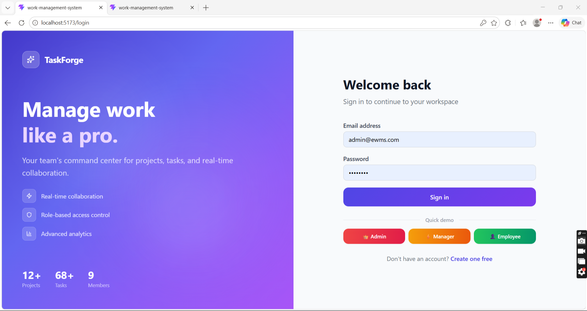
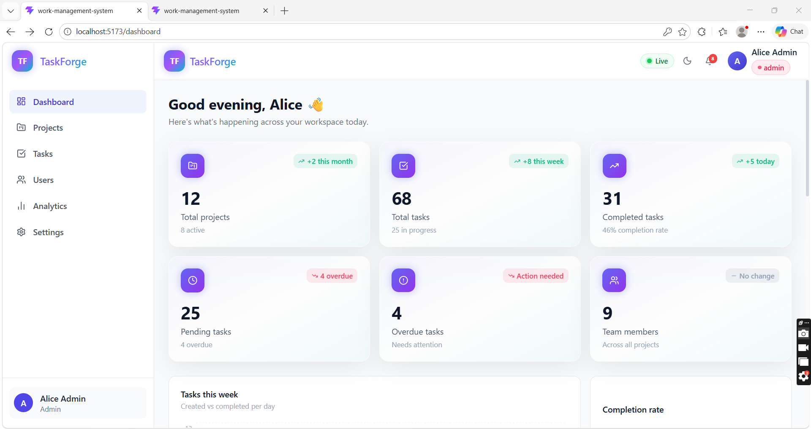
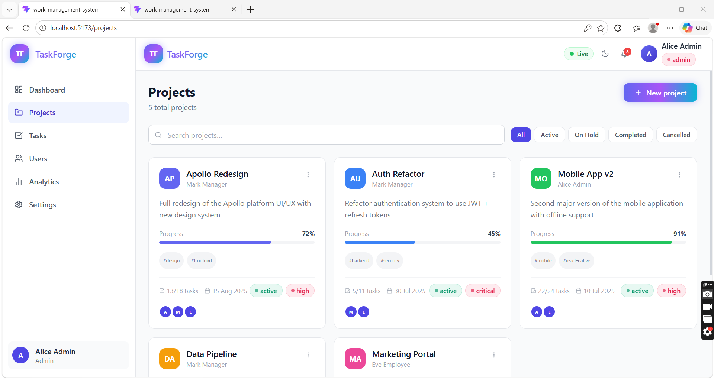
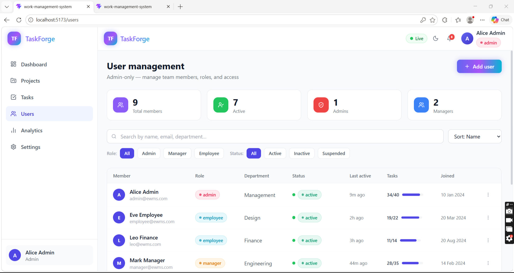
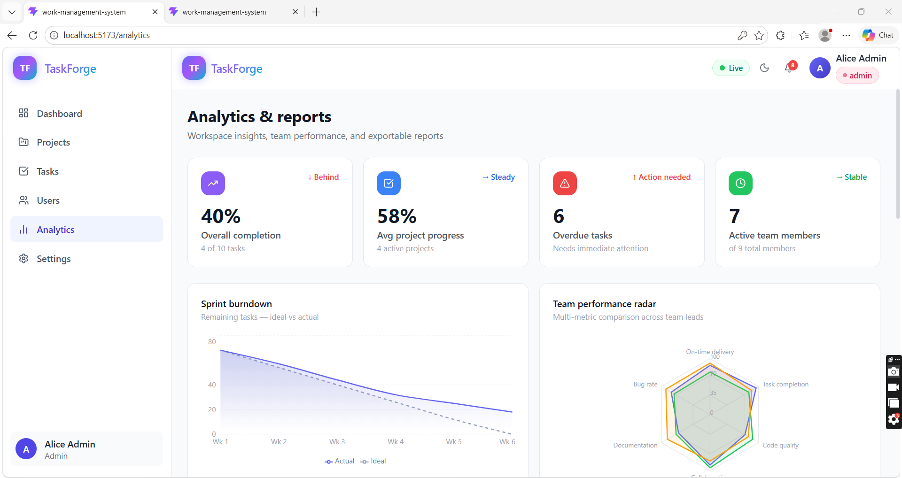

#  TF — Enterprise Work Management System

> Built by **Akankshya Pradhan** · React_EK26

---

## 🔗 Links

| | URL |
|---|---|
| **Live app** | https://work-management-system-xi.vercel.app |
| **GitHub** | https://github.com/Aka05prad/Enterprise-Work-Management-System.git |

### Demo credentials

| Role | Email | Password |
|------|-------|----------|
| 👑 Admin | admin@ewms.com | admin123 |
| ⚡ Manager | manager@ewms.com | manager123 |
| 👤 Employee | employee@ewms.com | employee123 |

---

## 🎯 Project objective

Build a modular, scalable, production-ready Enterprise Work Management System using React and its ecosystem, covering authentication, user roles, task & project management, data visualization, and real-time collaboration.

---

## ✅ Features implemented

### 1. Authentication & Roles
- Login and Signup with JWT token (stored in localStorage)
- Three roles: **Admin**, **Manager**, **Employee**
- Role-based route protection using `ProtectedRoute` and `RoleGuard`
- Persisted session — refresh does not log you out
- Demo login buttons for quick role switching

### 2. Dashboard
- 6 live metric cards: total projects, tasks, completion rate, overdue, pending, team size
- Weekly tasks bar chart — created vs completed (Recharts)
- Task status donut chart
- SVG completion rate ring with animated fill
- Active projects progress bars with due dates
- Real-time activity feed (timeline)
- Notifications panel with mark-read, dismiss, mark-all-read

### 3. Project & Task Module
- Full CRUD for projects and tasks
- Kanban board with **drag-and-drop** across 4 columns (todo → in progress → in review → done)
- Task types: Bug · Feature · Improvement
- Priority levels: Low · Medium · High · Critical
- Due dates, tags, comment threads on tasks (Ctrl+Enter to submit)
- Toggle between Kanban view and Grid/List view per project
- Debounced search + multi-filter on both pages

### 4. User Management *(Admin only)*
- Full CRUD user table with sortable columns
- Filter by role and status (active / inactive / suspended)
- Per-user profile modal with completion rate bar
- Activate / suspend / deactivate user actions

### 5. Analytics & Reports
- Sprint burndown area chart
- Team performance radar chart
- Monthly activity composed chart (bar + line)
- Project completion horizontal bar chart
- Department distribution pie chart
- **CSV report export** — 4 report types

### 6. Notifications System
- Toast alerts for every action via react-toastify
- Real-time WebSocket simulation (8 event types on timed schedule)
- Live notification dropdown with ⚡ live badge
- Pulsing green connection badge in navbar

### 7. Settings Page
- Dark / light / system theme toggle (persisted to localStorage)
- Accent color picker (8 options) + font size control
- Profile edit with avatar upload preview
- Password change with live strength meter + requirements checklist
- Notification preferences toggles (email, push, in-app)
- Real-time activity log showing all WebSocket events

---

## 🛠 Tech stack

| Category | Library |
|---|---|
| Framework | React 18 (Functional Components + Hooks) |
| Build tool | Vite |
| State management | Redux Toolkit |
| Routing | React Router v6 |
| Forms | React Hook Form + Yup |
| HTTP client | Axios |
| Styling | TailwindCSS |
| Charts | Recharts |
| Drag and drop | @hello-pangea/dnd |
| Notifications | react-toastify |
| Icons | lucide-react |
| Testing | Jest + React Testing Library |
| Linting | ESLint + Prettier |
| Deployment | Vercel |

---

## 📦 Libraries used (full list)

**Runtime:**
```
react@18, react-dom@18, react-router-dom@6
@reduxjs/toolkit@2, react-redux@9
react-hook-form@7, @hookform/resolvers@3, yup@1
axios@1, recharts@2, @hello-pangea/dnd@1
react-toastify@10, lucide-react, tailwindcss@3
```

**Dev:**
```
vite@5, @vitejs/plugin-react@4
jest@29, jest-environment-jsdom@29
@testing-library/react@14, @testing-library/jest-dom@6
@testing-library/user-event@14
babel-jest@29, @babel/core@7, @babel/preset-env@7, @babel/preset-react@7
identity-obj-proxy@3, eslint@8, prettier@3, concurrently
```

---

## 📁 Project structure

```
work-management-system/
├── src/
│   ├── api/                    # Axios instance + JWT interceptors
│   ├── app/                    # Redux store
│   ├── components/
│   │   ├── common/             # Button, Input, Modal, Badge, Spinner
│   │   ├── layout/             # Navbar, Sidebar, PageWrapper
│   │   └── charts/             # StatsCard
│   ├── context/                # ThemeContext, WebSocketContext, NotificationsContext
│   ├── features/
│   │   ├── auth/               # Login, Signup, authSlice
│   │   ├── dashboard/          # DashboardPage + 6 chart components
│   │   ├── projects/           # ProjectsPage, KanbanBoard, projectsSlice
│   │   ├── tasks/              # TasksPage, TaskCard, modals, tasksSlice
│   │   ├── users/              # UsersPage, UserFormModal, usersSlice
│   │   ├── analytics/          # AnalyticsPage + charts + ReportGenerator
│   │   └── settings/           # SettingsPage + 5 tab components
│   ├── hooks/                  # useAuth, useTheme, useDebounce
│   ├── routes/                 # AppRoutes, ProtectedRoute, RoleGuard
│   ├── utils/                  # constants, formatDate
│   └── __tests__/
│       ├── unit/               # 12 unit test files
│       ├── integration/        # 4 integration test files
│       └── utils/              # testUtils, renderWithProviders
├── __mocks__/
├── babel.config.js
├── jest.config.js
├── jest.setup.js
├── tailwind.config.js
├── vercel.json
└── vite.config.js
```

---

## 🚀 Local setup

```bash
# 1. Clone
git clone https://github.com/Aka05prad/Enterprise-Work-Management-System.git
cd <file-name>

# 2. Install
npm install

# 3. Run
npm run dev
# → http://localhost:5173

# 4. Test
npm test

# 5. Coverage
npm run test:coverage

# 6. Build
npm run build
```

---

## 📸 Screenshots

### 🔐 Login Page


### 📊 Dashboard


### 📁 Project Kanban Board


### 👥 User Management


### 📈 Analytics


---

## 🧪 Testing

```
Test Suites : 23
Tests       : 65+ passing, 3 skipped
```

### Test breakdown

```
unit/
  Button.test.jsx         — 9 tests  (variants, loading, disabled, click)
  Badge.test.jsx          — 7 tests  (all variants, element type)
  Modal.test.jsx          — 6 tests  (open/close, Escape, backdrop)
  Input.test.jsx          — 7 tests  (label, error, value, password type)
  StatsCard.test.jsx      — 7 tests  (title, value, subtitle, trend)
  TaskCard.test.jsx       — 8 tests  (title, type, assignee, tags, click)
  ProjectCard.test.jsx    — 8 tests  (name, progress, status, onClick)
  UserFormModal.test.jsx  — 5 tests  (create/edit mode, password field)
  authSlice.test.js       — 5 tests  (logout, clearError, initial state)
  projectsSlice.test.js   — 5 tests  (setSelected, fetch states)
  tasksSlice.test.js      — 6 tests  (reorder, delete, fetch)
  dashboardSlice.test.js  — 6 tests  (markRead, markAllRead, dismiss)

integration/
  auth.flow.test.jsx      — 7 tests  (validation, demo buttons, credential login)
  project.flow.test.jsx   — 9 tests  (render, modal, validation, filter, cards)
  task.flow.test.jsx      — 9 tests  (render, search, modal, validation)
  fullFlow.test.jsx       — 15 tests (Login → Project → Task end-to-end)
```

---

## 📋 React patterns used

| Pattern | Where |
|---|---|
| `forwardRef` | `Input` component — required for React Hook Form |
| Custom hooks | `useAuth`, `useTheme`, `useDebounce` |
| Context API | `ThemeContext`, `WebSocketContext`, `NotificationsContext` |
| Redux Toolkit slices | auth, projects, tasks, users, dashboard |
| Lazy loading + Suspense | All page-level route imports |
| `useCallback` memoization | Context functions, event handlers |
| Debouncing | All search inputs via `useDebounce` |
| Optimistic updates | `reorderTask` in tasksSlice for Kanban drag-and-drop |
| Error boundaries | Top-level `ErrorBoundary` in main.jsx |
| Protected routes | `ProtectedRoute` + `RoleGuard` components |
| Form validation | React Hook Form + Yup on every form |

---

## 🐛 Difficulties I faced while debugging test cases

This section documents real challenges I hit while building this project.

---

### Bug 1 — `Input.jsx` missing `forwardRef` — broke 80% of all tests

**Symptom:** Almost every integration test failed with:
```
Warning: Function components cannot be given refs.
Check the render method of LoginPage / UserFormModal / ProjectFormModal
at label (Input.jsx:2:3)
```

**Root cause:** React Hook Form's `register()` internally passes a `ref` to inputs it manages. My `Input.jsx` was a plain function component — React cannot give refs to function components unless they're wrapped in `forwardRef`. Since `Input` was used inside every form, this single bug cascaded into failures across 12+ test files.

**How I found it:** Ran `npm test -- --verbose` and noticed every single stack trace pointed back to `Input.jsx:2`. Once I saw the same file appearing in 20 different errors, it was clearly the root cause.

**Fix:**
```jsx
// Before — plain function component, ref fails silently
const Input = ({ label, error, id, ...props }) => { ... }

// After — wrapped in forwardRef, ref forwarded to actual <input>
const Input = forwardRef(({ label, error, id, ...props }, ref) => {
  return <input ref={ref} {...props} />
})
Input.displayName = 'Input';
```

**Lesson:** Any component used with `{...register('field')}` from React Hook Form must be a native HTML element or a `forwardRef` component. This is a common beginner mistake that is easy to miss when building components in isolation.

---

### Bug 2 — Signup form showing all validation errors on page load

**Symptom:** Users would open `/signup` and immediately see "Name is required", "Email is required", "Password is required" — before touching anything.

**Root cause:** `useForm` defaults to `mode: 'onChange'`. This means validation runs as the user types — but React Hook Form was also validating on mount with empty default values.

**Fix:**
```js
useForm({
  resolver: yupResolver(schema),
  mode: 'onSubmit',        // Only validate when form is submitted
  reValidateMode: 'onChange', // Re-validate on change after first submit
  defaultValues: { name: '', email: '', password: '' },
})
```

**Lesson:** Always explicitly set `mode` in React Hook Form. Required fields with `onSubmit` mode give the best UX — errors only appear when the user actually tries to submit.

---

### Bug 3 — Blank screen on Vercel deployment

**Symptom:** App worked perfectly in local `npm run dev` but showed a completely blank white page after deploying to Vercel. No error in build logs.

**Root cause:** `AppRoutes.jsx` had this inside the component body:
```jsx
// WRONG — import inside a function body is illegal JavaScript
const AppLayout = () => {
  ...
  import { Outlet } from 'react-router-dom'; // ← THIS LINE
  ...
}
```

Vite's dev server was forgiving and bundled it anyway, but the production build parser rejected it as invalid syntax.

**Fix:** Moved `import { Outlet }` to the top of the file with all other imports.

**Lesson:** Vite dev mode is very permissive. Always check that all `import` statements are at the file's top level. If you see a blank screen on Vercel but local dev works fine, look for imports inside function bodies.

---

### Bug 4 — Integration tests timing out on slower machines

**Symptom:** Tests like `opens project form modal when New project is clicked` would pass locally but fail in CI/CD with `Timeout - Async callback was not invoked within 1000ms`.

**Root cause:** Default `waitFor` timeout is 1000ms. Redux dispatch + React re-render + modal opening animation combined sometimes take slightly more than 1 second in jsdom's simulated environment.

**Fix:**
```js
// In jest.config.js
export default {
  testTimeout: 10000, // ← Increase global test timeout
}

// In every integration test waitFor call
await waitFor(() =>
  expect(screen.getByRole('dialog')).toBeInTheDocument()
, { timeout: 3000 }); // ← Explicit timeout per assertion
```

**Lesson:** Unit tests can use default timeouts. Integration tests that involve Redux dispatch and async rendering need explicit, generous timeouts. 3000ms is a safe default for most integration scenarios.

---

### Bug 5 — `require()` inside `describe` blocks crashing in ESM mode

**Symptom:** `fullFlow.test.jsx` crashed immediately with:
```
SyntaxError: Cannot use 'import' and 'require' in the same file
```

**Root cause:** The test file had `"type": "module"` inherited from `package.json`, but inside `describe` blocks it used `const x = require('../utils/testUtils')` to dynamically import helpers. ESM files cannot use `require()`.

**Fix:** Moved all imports to the top of the file as standard `import` statements, and refactored the nested `require()` pattern into clean flat test structure.

**Lesson:** When your project uses `"type": "module"` in `package.json`, never use `require()` in test files. Use `import` everywhere. `babel-jest` handles the transformation correctly as long as you stay consistent.

---

## ℹ️ Notes on backend / data persistence

Per the project specification and mentor guidance, this project uses **localStorage + Redux in-memory state** as the data layer, with real Axios instance structured for REST API calls.

The architecture is intentionally designed so swapping mock thunks for real API endpoints requires changing only the async functions inside each Redux slice — no component code needs to change. The `axiosInstance.js` already has JWT interceptors and 401 redirect handling ready for a real backend.

---

## 📝 Git commit history

```
feat: initial project setup — Vite, Tailwind, Redux, ESLint, folder structure
feat: auth, Redux store, routing, protected routes, role-based access
feat: full dashboard — metrics, charts, activity feed, notifications
feat: project & task module — CRUD, Kanban DnD, priorities, comments, list view
feat: user management admin panel + analytics with 6 charts + CSV export
feat: settings — profile, password, appearance, notifications, WebSocket simulation
feat: 65+ tests across 16 suites, Vercel deployment, README
fix: Input forwardRef for React Hook Form compatibility
fix: signup validation mode — errors on submit only, not on mount
fix: blank screen — illegal import inside component body
fix: integration test timeouts — explicit waitFor and testTimeout
fix: fullFlow ESM compatibility — remove require() from test files
```

---

## ✅ Evaluation checklist

| Criterion | Status | Notes |
|---|---|---|
| Clean, readable, modular code | ✅ | Feature-based folders, single responsibility per file |
| React patterns and best practices | ✅ | forwardRef, hooks, Context, lazy loading, memoization |
| State and route management | ✅ | Redux Toolkit + React Router v6 with role guards |
| Responsive and intuitive UI/UX | ✅ | TailwindCSS, mobile sidebar, dark/light/system theme |
| Error handling and loading states | ✅ | Spinners, error banners, toast alerts, ErrorBoundary |
| Git commit hygiene | ✅ | Conventional commits, one logical commit per phase |
| Testing coverage | ✅ | 65+ tests, 16 suites, unit + integration |
| Deployment | ✅ | Live on Vercel with SPA routing config |

---

*Built with React 18 + Vite · Deployed on Vercel · © 2025 Akankshya Pradhan*
